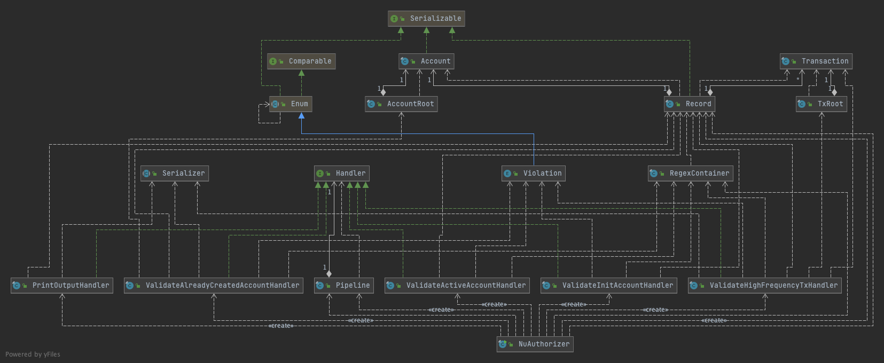

[](https://codecov.io/gh/jmanzanog/NuChallenge)
# Nubank Authorizer challenge!
This project solves the challenge posed in "Code Challenge: Authorizer"
## Discussing regarding the technical and architectural decisions

### Assumptions:
##### - The transactions will reach the Authorizer in chronological order:
This assumption rules out the need to order the transactions, so it will assume ordering in the transaction entries.
##### - The authorizer will deal with a single account:
this assumption ensures that race conditions caused by competition will not occur, so no efforts will be made to control this aspect.
##### - Assume that no input parsing errors will occur:
No validation will be done beyond that included in the input serialization
### Approach
The approach I have chosen to solve this problem is based on the PipelineProcessing software design pattern, it consists of generating a pipe composed of handlers that make a certain calculation given a specific input, each handler is integrated into the pipeline receiving and returning the same element at the same time that generates the calculation for which it was programmed, this allows us to make a highly extensible implementation because the handlers can be placed anywhere in the pipeline according to the convenience or requirement, the handlers contracts respect referential integrity because they are conceived as pure functions, Next the class diagram of the implementation:

## Installation

Application can be run in two ways:
#### 1. Container Docker
##### Requirements
- Docker version 20.10.8, build 3967b7d or higher

Once the directory containing all the files has been decompressed, the directory will be entered using the command console.
```sh
cd authorizer
```

Then the docker image is built using the build option.
```sh
docker build . -t nu-challenge
```

Next step is to run a docker container from the image that was just created
```sh
docker run -itd --name NuAuthorizer nu-challenge
```

Next step, copy the input files with which you want to test the application using the following command

```sh
docker cp </your/test/file> NuAuthorizer:/app/input.json
```
Example
```sh
docker cp src/test/resources/integration/case/TestProcessingTransactionsThatViolateMultipleLogics/input.json NuAuthorizer:/app/input.json
```
Now you can run the application using the following command
```sh
docker exec -it NuAuthorizer bash -c 'cat /app/input.json | java -jar /app/NuChallenge-1.0-all.jar'
```
#### 2. Executing jar directly
##### Requirements
- openjdk 11.0.0 or higher Installed
- JAVA_HOME environment variable set

Once the directory containing all the files has been decompressed, the directory will be entered using the command console.
```sh
cd authorizer
```
Run Gradle wrapper to clean a build app artifact
```sh
 ./gradlew clean build
```

Go to build guild directory using command cd
```sh
cd build/libs/
```

Now you can run the application using the following command
```sh
cat </your/test/file.json> | java -jar NuChallenge-1.0-all.jar
```
Example 
```sh
cat ../../src/test/resources/integration/case/TestProcessingTransactionsThatViolateMultipleLogics/input.json  | java -jar NuChallenge-1.0-all.jar
```

## Test
Tests of all the cases described in the description of the challenge were implemented, covering 98% of the written code
to run the test set you can do so by executing the command:

```sh
./gradlew clean test
```

When running the previous command, an HTML report generated with the Jacoco tool is included, you can access the report in the following path:

```sh
build/reports/jacoco/test/html/index.html
```

test